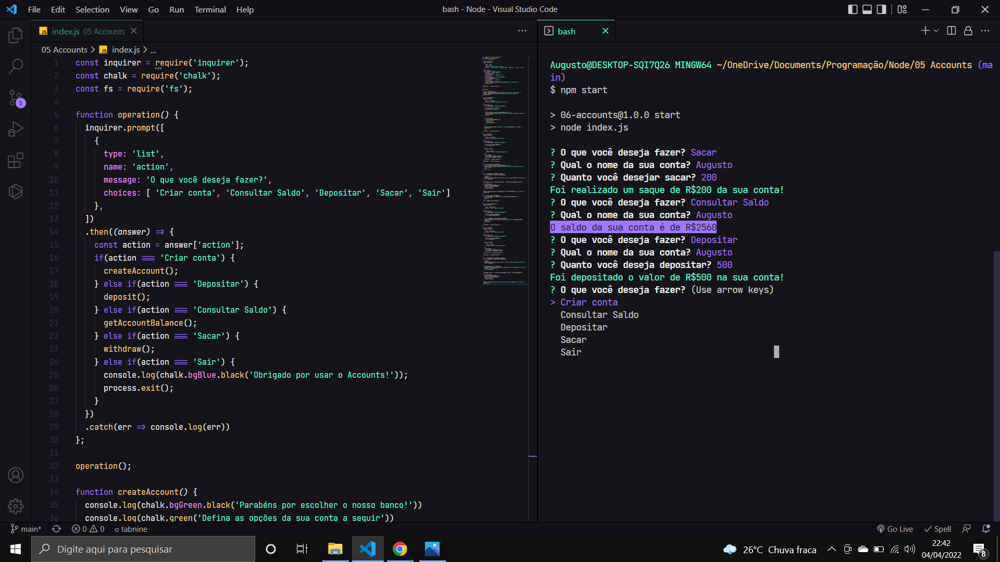

<h1>Projeto - Account com Nodejs puro</h1>
<h1 align="center"></h1>

### Um pouco sobre o projeto

Nesse projeto, foi desenvolvido um sistema que simula um caixa eletrônico no terminal, nele possui algumas funcionalidades como:
- Criação da conta do usuário;
- Consulta do saldo;
- Depositar dinheiro na conta;
- Sacar dinheiro da conta;
- Sair da conta.

Dentro do projeto foi introduzido dois módulos externos ( inquirer e chalk ) e também foi utilizado o Core Module fs.

### Habilidades desenvolvidas

- Verificação de dados do usuário;
- Tratamento de erros;
- Uso de módulos externos e Core Modules.

### Como rodar o projeto
```bash
# Clone o projeto
$ git clone https://github.com/augustodevjs/Accounts-node.js

# Instale todas as depedências
$ npm install

# Inicialize o projeto
$ npm start
```

# License
© Projeto feito pelo curso de Node.js do [Matheus Battisti](https://www.udemy.com/course/nodejs-do-zero-a-maestria-com-diversos-projetos/).
